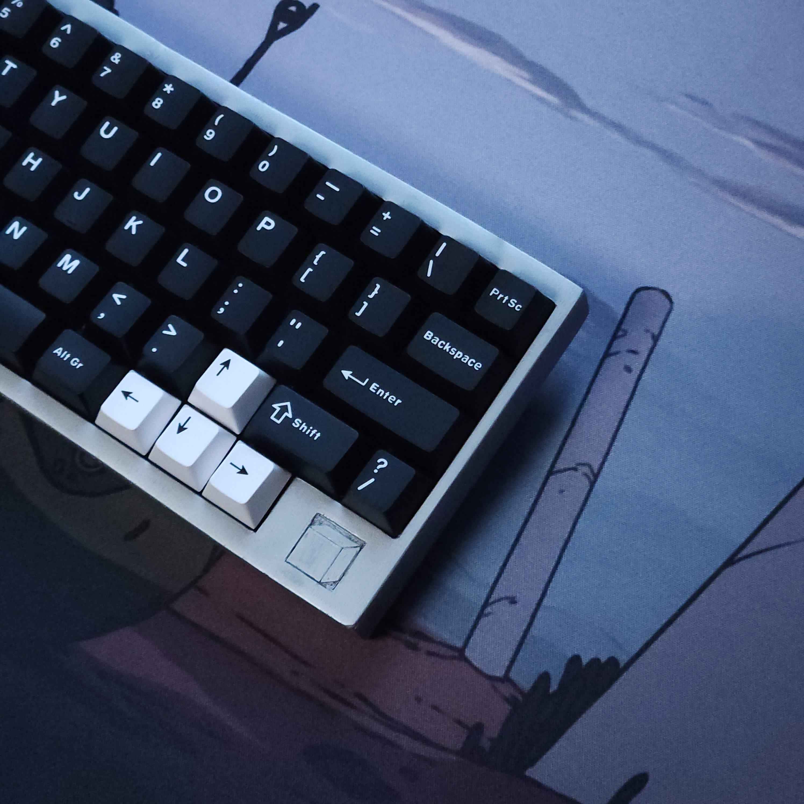
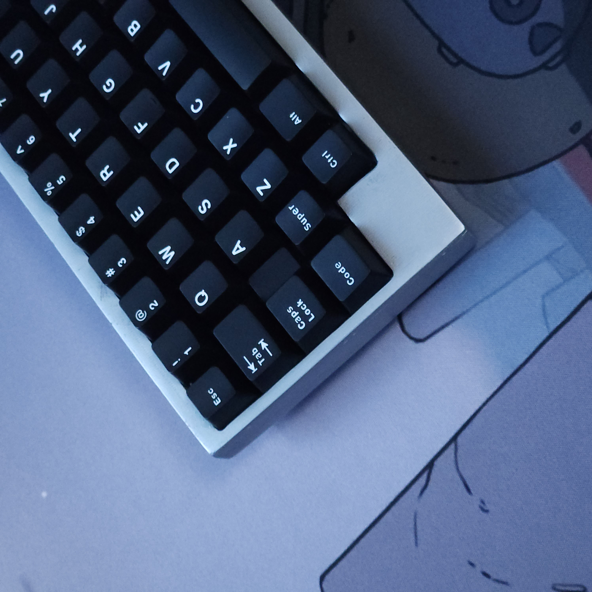
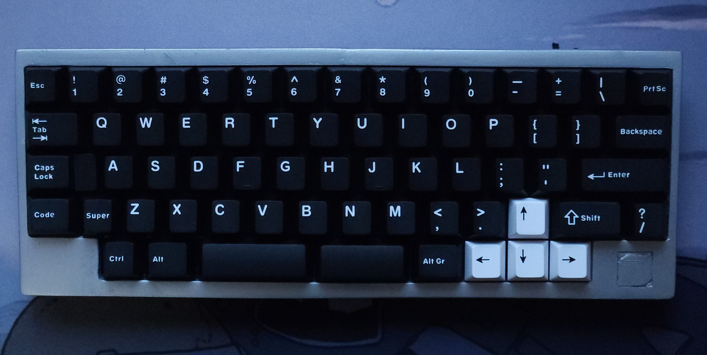
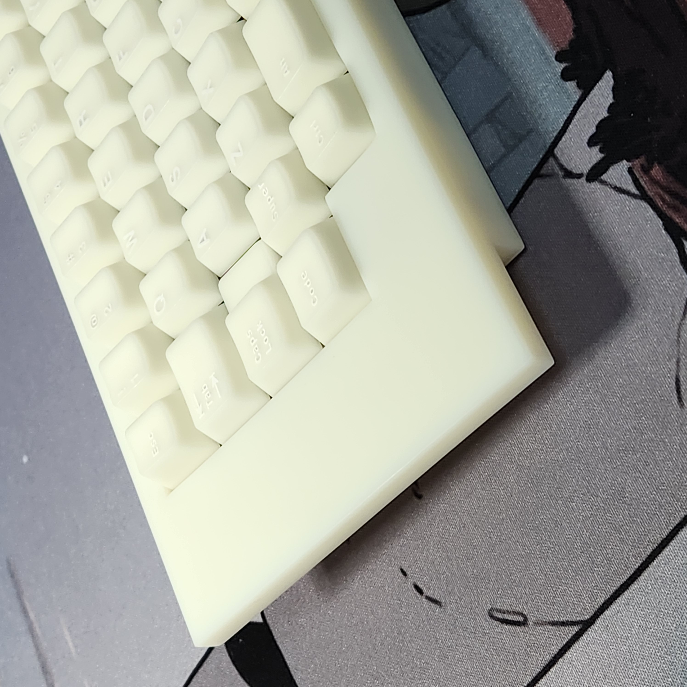
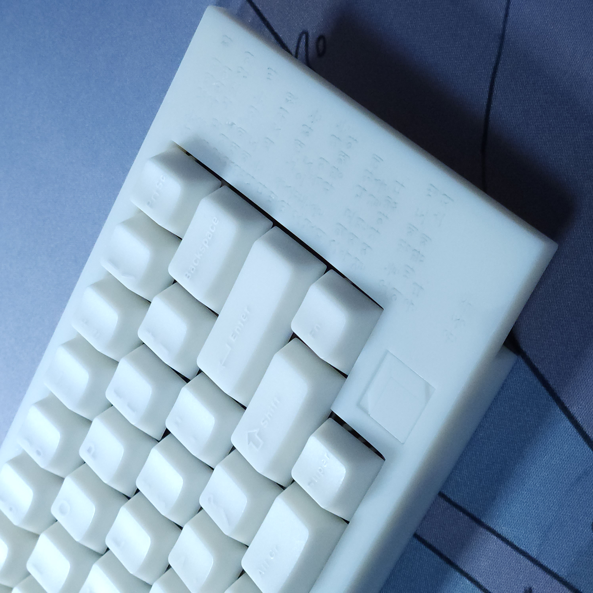
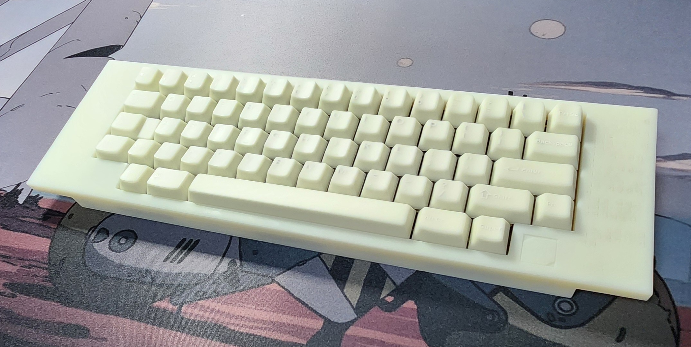

[프로젝트 과정(kr)](https://blog.naver.com/cosmosalad/223262540878)  

# Gear60 
Gear60 is a 60% multi-layout keyboard based on the rp2040.
 

It's mostly compatible with 60% layout keyboards. Just modify usb and plate to suit your keyboard housing

 

  
  

  

split_hhkb (fdm print)

  

  
  

  

hhkb - B type (sla print)

  

## Layout 

- solder 

  

- hotswap 

  

There is also a [keyboard plate](https://github.com/cosmosalad/Gear60/tree/main/plate). 
[Keyboard case](https://github.com/cosmosalad/Gear60/tree/main/case) corresponding to this layout. 

  

## PCB 
 
   

 
There is a change from the initial pcb design. [More pcb](https://github.com/cosmosalad/Gear60/tree/main/pcb)  
This pcb was made by jlcpcb.([list of pcb parts](https://github.com/cosmosalad/Gear60/blob/main/pcb/hotswap/part%20list.md))  
This pcb prepared the [vial](https://github.com/cosmosalad/Gear60/tree/main/vial) as firmware  

  

 

## Reference 
- [keyboard-layout-editor](http://www.keyboard-layout-editor.com/) 
- [Hardware design with RP2040](https://datasheets.raspberrypi.com/rp2040/hardware-design-with-rp2040.pdf?_gl=1*anhmk8*_ga*NTIyODYwMjcuMTcwODI1NDcxMw..*_ga_22FD70LWDS*MTcwODI1NDcxNC4xLjAuMTcwODI1NDcxNC4wLjAuMA..), [Hardware design for the RP2040](https://github.com/Sleepdealr/RP2040-designguide) 
- [kicad](https://www.kicad.org/), [marbastlib](https://github.com/ebastler/marbastlib), [kleeb](https://github.com/crides/kleeb) 
- [KiCAD KLE Placer](https://github.com/zykrah/kicad-kle-placer), [Firmware 'scripts'](https://github.com/zykrah/firmware-scripts) 
- [vial](https://get.vial.today/), [qmk](https://qmk.fm/) 
- [ai03 Plate Generator v2](https://github.com/ai03-2725/yet-another-keyboard-builder) 

